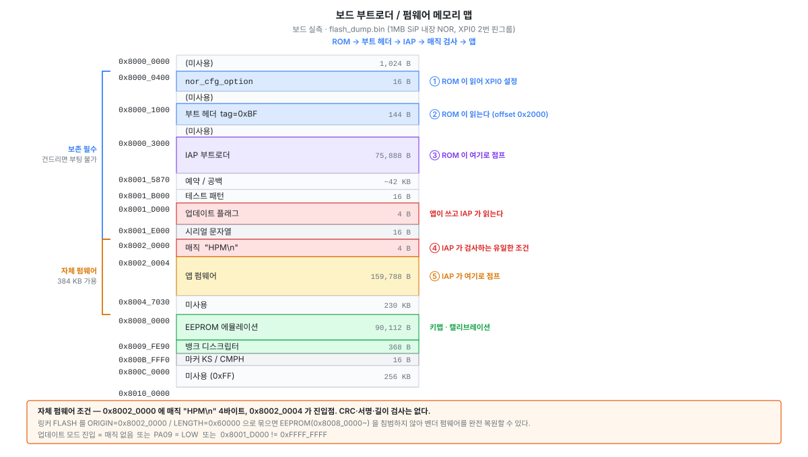

# 상용 보드 IAP 부트로더 / USB 업데이트 프로토콜

동일 MCU(HPM5361)를 쓰는 상용 홀이펙트 키보드의 IAP 부트로더를
[flash_dump.bin](flash_dump.bin) 에서 복원한 기록이다. 자체 펌웨어를 이 부트로더 위에
올리기 위한 **인터페이스 명세**로 쓴다.

- 대상: 상용 보드, HPM5361 (LQFP100)
- 근거: `analysis/iap.dis` · `analysis/app.dis` 디스어셈블 + USB 디스크립터 파싱
- 플래시 레이아웃과 앱 핀맵은 [flash_dump.md](flash_dump.md) 를 본다

> 어셈 원문과 바이너리는 [analysis/](analysis/) 에만 두고(`.gitignore` 대상)
> 여기엔 의사코드와 주소만 적는다.

---

## 0. 세 줄 요약

1. **IAP 가 앱을 인정하는 조건은 매직 4바이트뿐이다.** `0x80020000` 에 `"HPM\n"` 이 있으면 `0x80020004` 로 점프한다. CRC·서명·길이 검사가 없다.
2. **업데이트 모드 진입 경로가 3개**다 — 앱 매직 없음 / **PA09 버튼** / 플래시 플래그. 어느 하나만 걸려도 USB 업데이트 모드로 떨어진다.
3. **IAP 는 자기 자신을 덮어쓸 수 없다.** 업데이트 명령이 기록 주소를 `0x80020000` 으로 하드코딩한다. 그래서 IAP 만 보존하면 벽돌이 사실상 불가능하다.

---

## 1. 메모리 맵



| | 플래시 오프셋 | 실행 주소 | 크기 |
|---|---|---|---|
| 부트 헤더 | `0x001000` | `0x80001000` | 144 B (tag `0xBF`) |
| **IAP 부트로더** | `0x003000` | `0x80003000` | 75,888 B |
| **앱** | `0x020000` | `0x80020000` | — |

ROM 은 부트 헤더의 `app offset = 0x2000` 을 보고 `0x80001000 + 0x2000 = 0x80003000`,
즉 IAP 로 진입한다. 앱으로는 IAP 가 별도로 점프시킨다.

---

## 2. 부팅 판정

`0x80005F8C`~`0x80005FA8` 의 로직 전체다.

```c
printf(<부트로더 배너>);
printf("Unique ID 0x%08x%08x.", *(u32*)0x8001E004, *(u32*)0x8001E000);
printf("Magic boot ID 0x%08x.", *(u32*)0x8001D000);

if ( app_magic_ok()                        /* ① 0x80006ABC */
  && boot_pin_ok()                         /* ② 0x80006CB2 */
  && *(u32*)0x8001D000 == 0xFFFFFFFF )     /* ③ 플래시 플래그 */
{
    jump_to_app();                         /*   0x80006AA0 */
    for (;;) ;                             /*   돌아오지 않음 */
}
usb_update_mode();                         /*   위 셋 중 하나라도 실패하면 */
```

### ① 앱 매직 — `0x80006ABC`

```c
bool app_magic_ok(void) {
    return *(u32*)0x80020000 == 0x0A4D5048;   /* 리틀엔디안 바이트열 48 50 4D 0A = "HPM\n" */
}
```

**이게 전부다.** 길이·CRC·서명 검사는 이 경로 어디에도 없다.

### ② 부트 핀 — `0x80006CB2`

```c
bool boot_pin_ok(void) {
    int count = 0;
    for (int i = 0; i <= 9; i++) {
        if (gpio_read(GPIO0, port 0, pin 9) == 1) count++;   /* PA09 */
        delay(10);
    }
    return count > 6;      /* 10 회 중 7 회 이상 HIGH 여야 앱으로 간다 */
}
```

**PA09 를 LOW 로 잡고 전원을 넣으면 무조건 업데이트 모드다.** PA09 는 앱 핀맵에서
`PAD_CTL 0x01060000` = 풀업 + 히스테리시스 입력으로 확인된 핀이다
([flash_dump.md](flash_dump.md) 3 절). 보드상 어느 키/패드인지는 **미확인**.

### ③ 플래시 플래그 — `0x8001D000`

| 값 | 의미 |
|---|---|
| `0xFFFFFFFF` (소거 상태) | 앱으로 부팅 |
| 그 외 | **업데이트 모드 유지** |

앱이 여기에 값을 써서 "다음 부팅은 업데이트 모드" 를 예약한다(4 절). 덤프 시점의
`0x1D000` 은 `ff ff ff ff` 로, 정상 부팅 상태와 일치한다.

### 앱 점프 — `0x80006AA0`

```c
void jump_to_app(void) {
    __asm__("fence.i");
    deinit_peripherals();       /* 0x80007B92 */
    ((void(*)(void))0x80020004)();
}
```

스택 재설정도, 레지스터 정리도 하지 않는다. 앱의 `start.S` 가 알아서 해야 한다.

---

## 3. USB 업데이트 프로토콜

### 3.1 인터페이스

IAP 모드의 컨피그 디스크립터는 `0x80014A58` 에 있다(wTotalLength 123, 인터페이스 4 개).

| 인터페이스 | 엔드포인트 | 용도 |
|---|---|---|
| IF0 HID 부트키보드 | EP `0x81` IN 8 B | — |
| IF1 HID | EP `0x82` IN 32 B / EP `0x03` OUT 32 B | — |
| IF2 HID | EP `0x84` IN 32 B | — |
| **IF3 HID** | **EP `0x05` OUT 64 B / EP `0x85` IN 64 B** | **업데이트 채널** |

USB VID/PID 는 앱과 동일하고 **제품 문자열만 IAP 전용 값으로 바뀐다.**
호스트에서 앱 모드와 IAP 모드를 구분하는 가장 쉬운 방법이 이 문자열이다.

### 3.2 프레임

핸들러 `0x800064AE` 가 `usbd_ep_start_read(busid, ep=0x05, buf=0x86840, len=64)` 를 건다.
**요청·응답 모두 64 바이트 고정**이고 `buf[0]` 이 명령이다.

```
요청  (EP 0x05 OUT, 64 B) :  [0]=cmd  [1]=len  [2..3]=미사용  [4..63]=payload
응답  (EP 0x85 IN,  64 B) :  [0]=0x85  [1]=status (1=성공, 0=실패)  [2..63]=0
```

응답은 모든 명령에 대해 공통 경로 `0x80006832` 에서 만들어진다.

### 3.3 명령

| cmd | 이름 | 동작 | 페이로드 |
|---|---|---|---|
| `0x81` | 시작 | 기록 주소를 **`0x80020000` 으로 고정**, 총 길이 저장 | `[4..7]` = 총 길이 (LE32) |
| `0x80` | 데이터 | 4KB 페이지 버퍼(`0x80600`)에 누적 | `[1]` = 길이, `[4..]` = 데이터 |
| `0x82` | 페이지 기록 | 남은 부분을 `0xFF` 로 패딩 → 4KB 소거+기록 → 주소 진행 → 버퍼 리셋. 이어서 `[4..]` 를 다시 누적 | `0x80` 과 동일 |
| `0x83` | 종료 | 앱으로 점프 / 리부트 (`0x800061D2`) | — |

**`0x81` 이 주소를 하드코딩하는 것이 핵심 안전장치다.** 임의 주소를 줄 수 없으므로
호스트가 IAP 영역(`0x3000`~`0x15870`)이나 부트 헤더를 건드릴 방법이 없다.

### 3.4 RAM 버퍼

| 주소 | 크기 | 용도 |
|---|---|---|
| `0x86840` | 64 B | OUT 리포트 수신 버퍼 |
| `0x86880` | 64 B | IN 리포트 응답 버퍼 |
| `0x80600` | 4 KB | 페이지 스테이징 버퍼 |
| `0x861D4` | u16 | 페이지 버퍼에 쌓인 바이트 수 |
| `0x861D6` | u8 | flush 스킵 플래그 |

### 3.5 문자열 (디버그 출력)

| 주소 | 문자열 |
|---|---|
| `0x80014120` | 부트로더 배너 |
| `0x80014138` | `Unique ID 0x%08x%08x.` |
| `0x80014150` | `Magic boot ID 0x%08x.` |
| `0x8001428C` | `Erase and Write at address = 0x%08lX` |

---

## 4. 앱 → IAP 인계

앱에는 **자체 펌웨어 업데이트 로직이 없다.** 플래시 쓰기 능력은 있지만
(ROM API `ROM_API_TABLE_ROOT = 0x2001FF00` 경유, `0x80023A76`) 용도는 EEPROM
에뮬레이션과 아래 플래그 기록이다. 펌웨어 교체는 전부 IAP 에 위임한다.

`0x800394EA` — **업데이트 모드로 재부팅**:

```c
u32 magic = 0x0000FFFF;
flash_write(0x8001D000, &magic, 4);   /* 0x80023BC2 → ③ 플래그 세팅 */
flash_commit();                       /* 0x80023AAE */
usb_deinit(); gptmr1_ch1_stop();
delay(500);
printf("jumping to iap\n");
*(volatile u32*)0xF410001C = 10;      /* 0x80023A6C — 소프트 리셋 */
for (;;) ;
```

`0x8003953E` 는 **매직 기록만 빠진 동일 루틴** = 평범한 재부팅(IAP 가 앱으로 되돌림).

> IAP 는 `!= 0xFFFFFFFF` 만 보므로 값 자체는 의미가 없다. 벤더는 `0x0000FFFF` 를 쓴다.

> `0xF410001C` 는 [tools/openocd/soc/hpm5300.cfg](../tools/openocd/soc/hpm5300.cfg) 의
> `reset_soc` 가 쓰는 것과 같은 리셋 레지스터다.

### 전체 흐름 (웹 업데이터가 하는 일)

```
앱 모드
  └ 벤더 HID 명령 → 0x800394EA → 플래그 기록 + 소프트 리셋
      └ ROM → IAP → ③ 실패 → 업데이트 모드
          └ IAP 모드 로 재열거
              └ 0x81(시작) → 0x80/0x82 반복 → 0x83(종료) → 새 앱 부팅
```

---

## 5. 자체 펌웨어를 IAP 위에 올리기

> **실증 완료 (2026-08-13)** — `firmware/wish60-he` 를 이 방식으로 올려 부팅·USB CDC·CLI
> 까지 확인했다. 아래는 실제로 겪은 것을 반영한 내용이다.

부팅 조건 자체는 **두 가지뿐**이다.

1. `0x80020000` 에 4 바이트 `48 50 4D 0A` (`"HPM\n"`)
2. `0x80020004` 가 진입점 (`_start`)

링커 관점:

```ld
FLASH (rx) : ORIGIN = 0x80020000, LENGTH = 0x60000   /* 0x20000~0x80000 */

/* .nor_cfg_option / .boot_header 섹션은 /DISCARD/ — IAP 가 이미 갖고 있다 */
.iap_magic ORIGIN(FLASH) : { LONG(0x0A4D5048) }
__app_load_addr__ = ORIGIN(FLASH) + 4;
```

> **함정** — 원본 `.start` 섹션의 선두 `. = ALIGN(8);` 을 그대로 두면 진입점이
> `0x80020008` 로 밀려 IAP 의 점프가 빗나간다. 반드시 빼야 한다.

> `hpm_bootheader.c` 는 빌드에서 제외한다. `__app_offset__` 를 참조하는데 링커에서
> 그 심볼을 없앴기 때문이다.

### ★ IAP 인계 상태를 정리해야 한다 — 안 하면 부팅 직후 죽는다

ROM 이 직접 앱을 띄우는 EVK 와 달리, IAP 는 **주변장치를 켜둔 채** 점프한다.
`mstatus.MIE` 를 여는 순간 등록되지 않은 벡터로 점프해 `default_irq_handler`
무한루프(`0x19C`)에 빠진다.

**세 가지를 모두 해야 한다** (`system_init()` 이 weak 이므로 덮어쓴다):

```c
write_csr(CSR_MIE, 0);                     /* ① start.S 는 mstatus 만 지운다 */

for (irq = 1; irq < 128; irq++)            /* ② IAP 가 켜둔 PLIC enable */
    intc_m_disable_irq(irq);

volatile uint32_t *claim =                 /* ③ ★ 남은 pending 배수 */
    (volatile uint32_t *)(HPM_PLIC_BASE + HPM_PLIC_CLAIM_OFFSET);
for (i = 0; i < 128; i++) {
    uint32_t id = *claim;
    if (id == 0) break;
    *claim = id;                           /* complete */
}
```

**③ 이 핵심이다.** enable 을 전부 0 으로 만든 뒤에도 claim 레지스터가 계속
`6`(GPTMR1) 을 내줬다 — IAP 가 리포트 주기를 GPTMR1 로 돌리다가 끄지 않고 넘기기
때문이다. 마스킹만으로는 안 되고 pending 자체를 비워야 한다.

셋을 모두 하면 SDK 원본과 같은 위치(`system_init()` 끝)에서 전역 인터럽트를 켤 수 있고,
애플리케이션 코드는 EVK 와 동일하게 유지된다.

### ★ 외부 전원 보드에서는 DCDC 전압을 설정하면 안 된다

`pcfg_dcdc_set_voltage()` 를 호출하면 `VOLT` 필드에는 값이 들어가고 `MODE` 도
`001`(basic) 인데 `DCDC_MODE.READY`(bit28) 가 영영 서지 않아 `pcfg_dcdc_is_stable()`
에서 **무한 대기**한다. SDK 원본 주석이 경고하던 그대로다.

상용 펌웨어도 같은 값(1175mV)을 쓰지만 구버전 SDK 라 `READY` 를 기다리지 않아
그냥 넘어간다. **자체 설계(외부 LDO)에도 그대로 적용되는 함정이다.**

`LENGTH` 를 384 KB 로 묶으면 `0x80000` 이후 EEPROM 영역을 침범하지 않아
**벤더 펌웨어를 언제든 완전 복원할 수 있다.**

### 보존해야 할 영역

| 영역 | 이유 |
|---|---|
| `0x000400` nor_cfg_option | ROM 이 XPI0 를 설정하는 데 필요 |
| `0x001000` 부트 헤더 | ROM 이 IAP 로 진입하는 데 필요 |
| `0x003000`~`0x015870` IAP | 복구 경로 · 업데이트 채널 |
| `0x01D000` | 업데이트 플래그(4 B). 나머지는 `0xFF` |
| `0x01E000` | 시리얼 문자열 (16 B) |
| `0x080000`~ | EEPROM 에뮬레이션(캘리브레이션) |

### 주의

자체 앱이 매직을 갖고 있으면 IAP 는 **계속 그리로 점프한다.** 앱이 초기화 중 멈추면
① 자동 복구가 안 걸리므로, JTAG 로 `0x20000` 섹터를 소거하거나 PA09 를 잡아야 한다
([debug-recovery.md](debug-recovery.md)).

---

## 6. 미확정

- **PA09 가 보드상 어느 키/패드인지** 미확인. 하드웨어 강제 진입 경로라 실측 가치가 크다.
- 명령 경로 어디에서도 CRC·서명 검사를 찾지 못했으나 **전수 감사는 아니다.**
  `0x83` 의 상태 변수(`gp[-1360]`) 조건과 `0x9FE90` 뱅크 디스크립터 CRC 의 관계는 미확인.
- `0x82` 의 주소 진행 로직과 두 번째 버퍼(`0x827A0`)는 디스어셈블 정렬이 어긋난
  구간이 있어 세부가 불확실하다.
- 앱이 IAP 진입 루틴을 **어떤 USB 명령으로** 부르는지는 추적하지 않았다.
  자체 펌웨어에서는 CLI 명령으로 대체하면 되므로 실용상 불필요.
