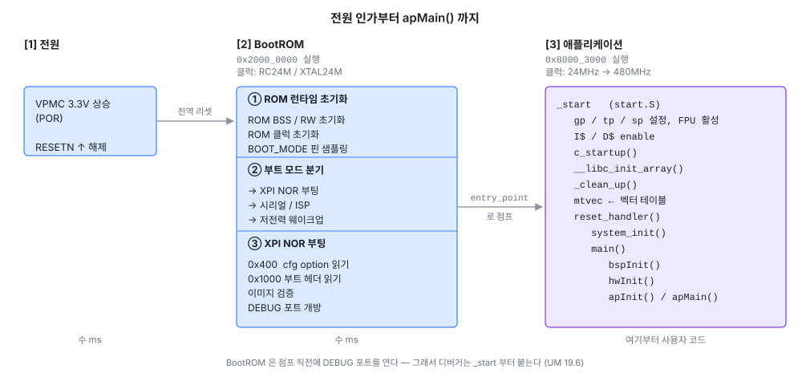
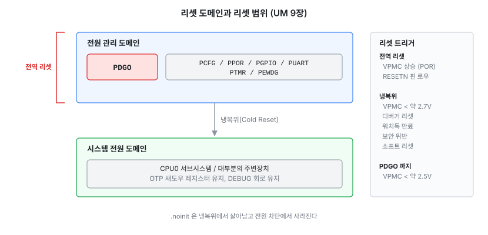
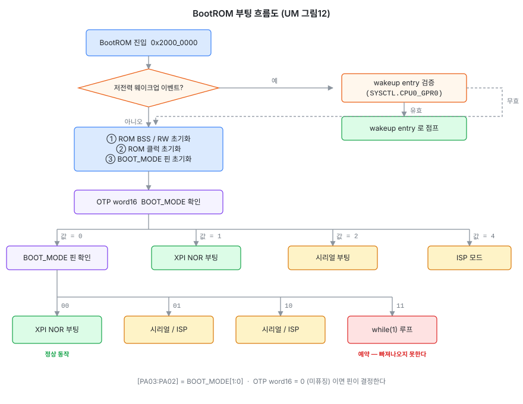
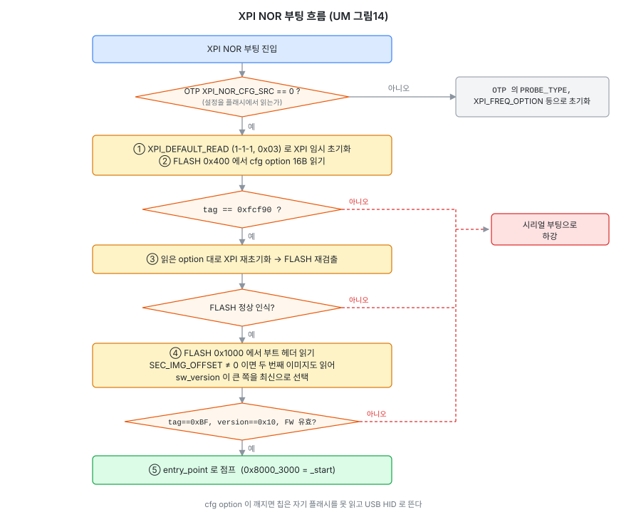
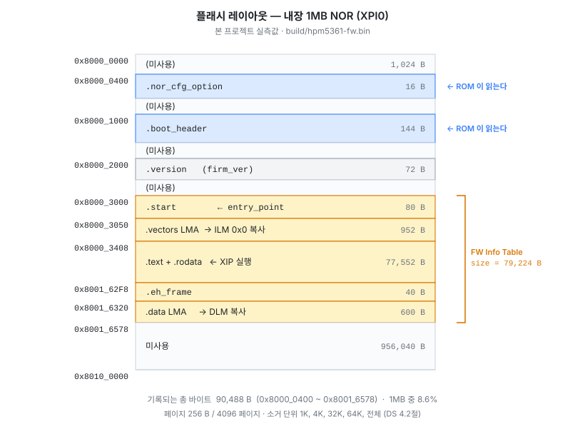
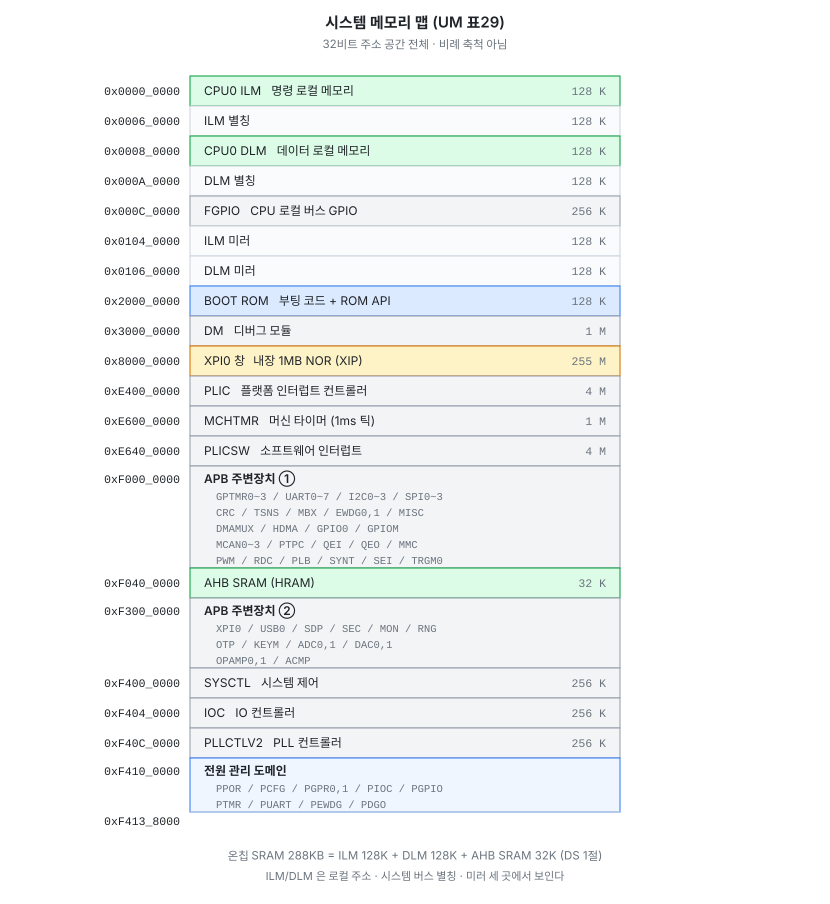
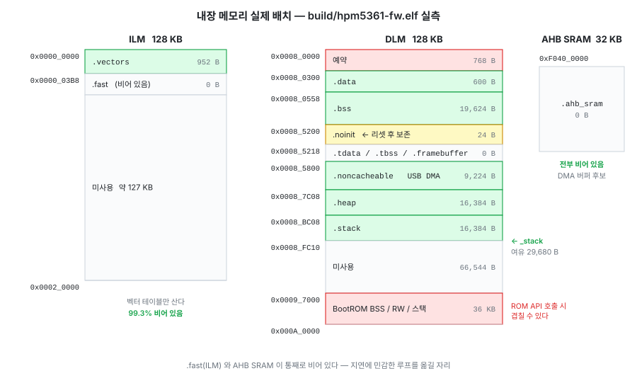
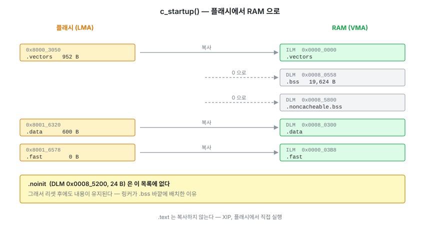
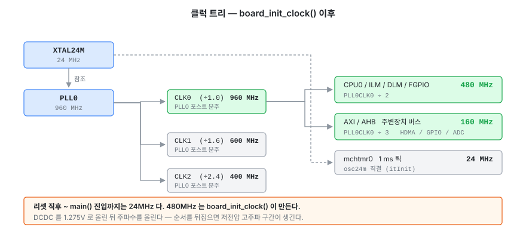

# HPM5361 부팅 시퀀스와 메모리 맵

- 작성일: 2026-08-02
- **1차 근거: HPM5300 시리즈 사용자 매뉴얼(레퍼런스 매뉴얼) Rev1.1** (`HPM5300UMV11.pdf`) — 장/표/그림 번호로 인용
- **2차 근거: HPM5300 시리즈 데이터시트 Rev0.12** (`HPM5300DSV012.pdf`)
- 3차 근거: 본 프로젝트 소스 + `build/hpm5361-fw.{elf,bin,map}` 실측값 (커밋 a74cd71 기준 빌드)

> **범위**: 전원 인가부터 `apMain()` 진입까지의 실행 경로와, 그 과정에서 쓰이는 주소 공간 전부.
> 안전 부팅(서명/암호화)과 ISP 명령 프로토콜은 사용하지 않으므로 존재만 언급하고 넘어간다.
> 전원/클럭 **회로**는 [hpm5361-power-clock-design.md](hpm5361-power-clock-design.md),
> 상용 보드 플래시 덤프 분석은 [flash_dump.md](flash_dump.md) 를 본다.

---

## 0. 이 칩의 부팅에서 먼저 알아야 할 4가지

| # | 사실 | 근거 | 영향 |
|---|---|---|---|
| 1 | **1MB 플래시는 칩 안에 있다.** 외장 NOR가 아니라 SiP로 동봉된 NOR가 XPI0 **2번 핀 그룹(PX00~PX07)** 에 붙어 있다 | DS 표44, 그림23 / UM 표83 / `board.c:43` 의 `option[2]=0x1000` | 보드에 플래시 부품이 없다. `option[2]`의 핀 그룹 값을 건드리면 부팅 불가 |
| 2 | **리셋 직후 CPU는 24MHz다.** 480MHz는 ROM이 아니라 `board_init_clock()` 이 만든다 | UM 13.8.25 (GLOBAL00 리셋값 0 = "24M 시계") | 초기화 이전 코드는 20배 느리다. 부팅 시간 측정 시 이 구간을 빼먹지 말 것 |
| 3 | **LQFP100은 내부 RC(IRC24M) 부팅을 지원하지 않는다** | DS 표45 | 24MHz 크리스털 발진 실패 = 부팅 불가. 옵션 부품이 아니다 |
| 4 | **LQFP100만 USB로 ISP가 된다.** LQFP64/QFN48은 UART0 전용 | DS 표45, 2.5절 | 디버거 없이 USB로 복구 가능. 벽돌 탈출구다 |

---

## 1. 전체 그림 — 전원 인가부터 `apMain()` 까지



BootROM은 **점프 직전에 DEBUG 포트 접근 권한을 연다**(UM 19.6). 그래서 디버거가 `_start`에는
붙을 수 있어도 ROM 구간에는 못 붙는다(CREATE 라이프사이클 제외).

---

## 2. 리셋 — 어디까지 지워지는가 (UM 9장)



| 리셋 종류 | 트리거 | 범위 |
|---|---|---|
| **전역 리셋** | VPMC 상승(POR), RESETN 핀 로우 | 칩 전체 (PDGO 포함) |
| **냉복위** | VPMC < 약 2.7V (BOR), 디버거 리셋, 워치독 만료, 보안 위반, 소프트 리셋 | 시스템 전원 도메인. OTP 섀도우/DEBUG 유지 |
| VPMC < 약 2.5V | 심한 저전압 | 냉복위 + PDGO까지 |
| 서브시스템 리셋 | SYSCTL 레지스터 | 지정한 블록만 |

RESETN은 전용 IO이고 기본 동작이 전역 리셋이다. PDGO를 살리고 싶으면 BDGO로 범위를 바꾼다(UM 11.3).

> 본 프로젝트의 `.noinit` 영역(`hpm5361_it.c` 의 fault 로그)은 **RAM 내용 보존 + `c_startup()` 이
> 지우지 않음** 두 조건에 의존한다. 워치독/소프트 리셋에서는 살아남고, 전원을 끊으면 사라진다.

---

## 3. BootROM 분기 — 어느 모드로 갈지 정하는 순서 (UM 그림12)



### BOOT_MODE 핀 (DS 표4 / UM 표86)

| PA03 (BOOT1) | PA02 (BOOT0) | 모드 |
|---|---|---|
| 0 | 0 | **XPI NOR 부팅** — 정상 동작 |
| 0 | 1 | ISP / 시리얼 부팅 (UART0 또는 USB0) |
| 1 | 0 | ISP / 시리얼 부팅 (UART0 또는 USB0) |
| 1 | 1 | 예약 — **`while(1)` 로 빠진다** |

### OTP word16 `BOOT_MODE` (UM 표82)

| 값 | 의미 |
|---|---|
| **0 (미퓨징 상태)** | **핀으로 결정** ← 공장 출하 상태이자 본 프로젝트 상태 |
| 1 | XPI NOR 부팅 고정 (핀 무시) |
| 2 | 시리얼 부팅 고정 |
| 4 | ISP 모드 고정 |

> OTP는 되돌릴 수 없다. `BOOT_MODE=1` 을 굽는 순간 BOOT0 버튼으로 ISP에 들어가는 길이 막힌다.
> 양산 잠금이 목적이 아니면 굽지 않는 게 맞다.

### 시리얼 부팅 / ISP 인터페이스 (UM 19.2.3~19.2.5)

| 인터페이스 | 핀 | 파라미터 |
|---|---|---|
| UART0 | PA00(TXD) / PA01(RXD) | 115200 8-N-1 기본, `config-rte` 로 변경 가능. 패킷 시작바이트 `0x5A`, CRC16(XMODEM 변종) |
| USB0 | USB_DP / USB_DM (LQFP100 전용) | USB-HID. OUT=엔드포인트1, IN=엔드포인트2. 페이로드 최대 512B |

ISP 지원 명령: `query-rte`, `config-rte`, `configure-memory`, `write-memory`, `read-memory`,
`load-image`, `erase`, `reset`, `gen-fwblob`. 대상은 온칩 RAM(0) / XPI0 NOR(0x10000) / OTP(0x20000).

---

## 4. XPI NOR 부팅 상세 (UM 그림14)



두 번째 이미지가 있는데 최신 쪽 검증에 실패하면, ROM은 구버전 이미지로 한 번 더 시도한 뒤
그것도 실패해야 시리얼 부팅으로 내려간다.

### 4.1 플래시 0x400 — `nor_cfg_option` (UM 표65)

`src/bsp/device/board.c:43` 이 `.nor_cfg_option` 섹션에 박는 16바이트다. **이게 없거나 깨지면
칩은 자기 플래시를 읽지 못하고 시리얼 부팅으로 떨어진다.** 실측 바이너리 값:

```
0x8000_0400:  02 00 f9 fc   05 00 00 00   00 10 00 00   00 00 00 00
            = { 0xfcf90002,  0x00000005,   0x00001000,   0x00000000 }
                 ─────┬───    ────┬────     ────┬────
                   헤더        Option0       Option1
```

| 워드 | 필드 | 값 | 해석 |
|---|---|---|---|
| `option[0]` | tag [31:12] | `0xfcf90` | 고정 태그. 이 값이어야 ROM이 인정한다 |
| | words [3:0] | `2` | 헤더 제외 유효 워드 수 = 2 (`option[1]`, `option[2]`) |
| `option[1]` | 탐지 타입 [31:28] | `0` | SFDP SDR |
| | POR 후 명령 패드 [27:24] | `0` | SPI (1비트) |
| | 설정 후 명령 패드 [23:20] | `0` | SPI |
| | Quad Enable 시퀀스 [19:16] | `0` | 불필요/자동 |
| | 더미 사이클 [15:8] | `0` | 자동 탐지 |
| | 기타 [7:4] | `0` | 없음 |
| | **주파수 옵션 [3:0]** | **`5`** | **102MHz** (UM 19.8.2.1 주파수 표) |
| `option[2]` | IO 전압 [19:16] | `0` | 3V |
| | **핀 그룹 [15:12]** | **`1`** | **2번 그룹 = PX00~PX07** ← SiP 내장 플래시 경로 |
| | 연결 방식 [11:8] | `0` | PORTA_CS0 |
| | 드라이브 강도 [7:0] | `0` | 기본값(최대) |

> **주파수 옵션은 5(102MHz)** 다. 참고로 [flash_dump.md](flash_dump.md) 의 상용 보드는 `6`(120MHz)
> 이었다. 값과 실제 주파수 대응은 UM 19.8.2.1에 있고, PLL1CLK1을 바꾸면 이 주파수도 같이 변한다.

| 값 | 1 | 2 | 3 | 4 | 5 | 6 | 7 | 8 |
|---|---|---|---|---|---|---|---|---|
| 주파수 | 31MHz | 50MHz | 66MHz | 80MHz | **102MHz** | 120MHz | 133MHz | 166MHz |

> **링커 스크립트 주석을 고칠 것.** `HPM5361_FLASH_XIP.ld:19` 는 `_flash_size = 1M` 옆에
> "`hpm5300evk : on-board QSPI NOR 1MB`" 라고 적어두었는데, 실제로는 온보드 부품이 아니라
> **칩에 동봉된(SiP) 1MB NOR** 이다(DS 4.2절, 표44). 크기는 맞으니 동작에는 영향이 없다.

### 4.2 플래시 0x1000 — 부트 헤더 (UM 표61 / 표62)

`hpm_bootheader.c` 가 만들고 링커가 `.boot_header` 로 배치한다. 실측 바이너리 값:

```
0x8000_1000  FW Container Header (16B)
  +0x00 tag                      0xBF     ← 필수. 이 값이 아니면 이미지 무효
  +0x01 version                  0x10     ← 이 SoC는 0x10 고정
  +0x02 length                   144      ← 헤더+정보표+설정블록+서명블록 전체
  +0x04 flags                    0x00000000  서명 없음, 라이프사이클 변경 없음
  +0x08 sw_version               0        ← 이미지 2개일 때 최신 판정 기준
  +0x0A fuse_version             0        ← 롤백 방지. OTP SW_VER 이상이어야 함
  +0x0B number_of_fw             1        ← 펌웨어 1개
  +0x0C device_config_block_off  0        ← 없음
  +0x0E signature_block_offset   0        ← 없음 (비서명 부팅)

0x8000_1010  FW Info Table (128B, 실사용 앞 0x28B)
  +0x00 offset       0x00002000  ← 헤더 기준 상대. 0x1000 + 0x2000 = 0x3000
  +0x04 size         79224       ← 0x13578. 링커의 __fw_size__
  +0x08 flags        0x00000000  실행 이미지 / CPU0 / 해시 없음 / 비암호화
  +0x10 load_addr    0x80003000  ← XIP이라 로드 주소 = 실행 주소
  +0x18 entry_point  0x80003000  ← _start. ROM이 여기로 점프한다
  +0x20 hash[64]     전부 0      ← 해시 미사용
```

`size = 79224 = 0x13578` 은 `0x8001_6578 − 0x8000_3000` 과 정확히 일치한다. 즉 `.start` 부터
`.data` LMA 끝까지 전부를 덮는다 — 링커의 `__fw_size__` 계산이 맞다는 뜻이다.

> **비서명 부팅이다.** `signature_block_offset = 0`, 해시 전부 0. 라이프사이클이 SECURE로 넘어가면
> ROM은 서명된 이미지만 부팅하므로 이 이미지는 거부된다(UM 19.8.6). 개발 중에는 문제 없다.

---

## 5. 플래시 레이아웃 (1MB, 본 프로젝트 실측)



- 기록되는 총 바이트: `0x8000_0400 ~ 0x8001_6578` = **90,488 B** (`build/hpm5361-fw.bin` 크기와 일치)
- **1MB 중 약 8.6%** 사용. 남는 934KB는 아직 용도가 없다
- 플래시 소거 단위: 1KB(4페이지) / 4KB / 32KB / 64KB / 전체. 페이지 = 256B, 총 4096페이지 (DS 4.2절)
- 내구성 200k 사이클, 보존 50년 (25°C, DS 표10)

> **두 번째 이미지(A/B 뱅크)를 넣을 여지가 있다.** OTP `SEC_IMG_OFFSET` 은 256KB 단위이므로
> 0x40000 / 0x80000 / 0xC0000 중 하나에 두 번째 부트 이미지를 놓고 `sw_version` 으로 최신을
> 고르게 할 수 있다. 상용 보드([flash_dump.md](flash_dump.md))는 이 방식 대신 자체 IAP
> 부트로더를 0x3000 에 두고 앱을 0x20000 에 두는 구조를 썼다.

---

## 6. 시스템 메모리 맵 (UM 표29)



- **ILM/DLM은 별칭이 여러 개다.** ILM은 `0x0000_0000`(CPU 로컬, 가장 빠름), `0x0006_0000`,
  `0x0104_0000` 세 주소로 보인다. 링커는 로컬 주소를 쓰고, DMA/디버거가 접근할 때는
  시스템 버스 별칭이 필요할 수 있다.
- **온칩 SRAM 288KB** = ILM 128K + DLM 128K + AHB SRAM 32K (DS 1절).
- BootROM은 128KB지만 실제 코드/데이터가 이 창 전체를 채우지는 않는다.

---

## 7. 내장 메모리 상세 — 본 프로젝트의 실제 배치

`build/hpm5361-fw.elf` 섹션 헤더 실측값이다.



| 영역 | 크기 | 사용 | 여유 |
|---|---|---|---|
| ILM | 128 KB | 952 B | 99.3% |
| DLM | 128 KB | 64,528 B (예약 768B 포함) | 50.8% |
| AHB SRAM | 32 KB | 0 | 100% |
| 플래시 | 1 MB | 90,488 B | 91.4% |

### 짚어둘 것

- **BootROM RAM 영역과의 충돌은 지금 없다.** ROM은 `0x0009_7000 ~ 0x0009_FFFF` (DLM 상위 36KB)를
  BSS/RW/스택으로 쓴다(UM 표88). 링커는 DLM 끝(`0x000A_0000`)까지 배정할 수 있으므로 스택이
  자라면 겹칠 수 있지만, 현재 스택 최상단이 `0x0008_FC10` 이라 **29,680 B 여유**가 있다.
  ROM API(플래시 쓰기 등)를 호출할 계획이라면 이 영역을 앱 데이터로 쓰지 말아야 한다.
- **`.fast` 와 AHB SRAM이 통째로 비어 있다.** 8kHz 홀 키보드처럼 지연에 민감한 루프를 넣게 되면
  ISR/스캔 루프를 `.fast`(ILM)로 옮기는 게 가장 싼 최적화다. XIP 플래시 102MHz + I$ 미스보다
  ILM 직접 실행이 훨씬 결정적이다.
- **`.noncacheable` 이 9KB나 된다.** 전부 USB 스택(CherryUSB) 디스크립터/전송 버퍼다.
  2048B 정렬 때문에 `.noinit` 끝(`0x85218`)과 시작(`0x85800`) 사이에 1,512B 구멍이 생긴다.
- **DLM 앞 768B 예약**은 SDK의 모든 HPM5361 링커 스크립트(`flash_xip.ld`, `ram.ld`, `flash.ld`,
  `flash_uf2.ld`, `flash_dfu.ld`)에 동일하게 들어 있다. 매뉴얼에서 이 영역의 용도를 명시한 곳은
  찾지 못했다. **근거를 확인하기 전까지 이 768B를 회수하지 말 것.**

---

## 8. `_start` 이후 — 앱이 스스로 하는 일

`src/lib/hpm_sdk/soc/HPM5300/HPM5361/toolchains/gcc/start.S`

| # | 코드 | 하는 일 |
|---|---|---|
| 1 | `la gp / la tp` | 전역 포인터(`__global_pointer$` = `.data` 시작 + 0x800), 스레드 포인터 설정 |
| 2 | `csrrw x0, mstatus, x0` | mstatus 0으로 리셋 |
| 3 | `csrrs mstatus, FS` + `fscsr` | FPU 활성화 (RV32-F/D) |
| 4 | `la sp, _stack` | 스택 포인터 = `0x0008_FC10` |
| 5 | `l1c_ic_enable` / `l1c_dc_enable` + invalidate | **L1 I$ 16KB / D$ 16KB 켜기.** XIP 성능은 여기서 결정된다 |
| 6 | `call c_startup` | LMA→VMA 복사와 BSS 클리어 (아래 9절) |
| 7 | `call __libc_init_array` | C++ 전역 생성자 / `.init_array` 실행 |
| 8 | `call _clean_up` | PLIC 정리 — 임계값 0, IRQ 0~127 complete, enable 레지스터 0으로. 디버깅 편의용 |
| 9 | `la t0, __vector_table; csrw mtvec` + `csrsi CSR_MMISC_CTL, 2` | 트랩 벡터를 ILM의 벡터 테이블로. **벡터 모드** PLIC 활성화 |
| 10 | `call reset_handler` | → `fencei()` → `system_init()` → `main()` |

`system_init()` (`system.c:29`): MCYCLE CSR 접근 허용 → 전역 IRQ 차단 → PLIC 벡터/선점 우선순위
기능 활성화 → 전역 IRQ 재개방.

`main()` (`src/main.c`): `bspInit()` → `hwInit()` → `apInit()` → `apMain()`.
`bspInit()` 은 `board_init()` + `itInit()`(mchtmr 1ms 틱) 두 가지만 한다.

> **주의: 캐시는 `c_startup()` 보다 먼저 켜진다.** 5번이 6번보다 앞이다. `bsp.c` 주석이 이 순서를
> 정확히 적어두고 있다. 캐시 관련 문제를 쫓을 때 "초기화 전이라 캐시가 꺼져 있겠지"라고 가정하면 틀린다.

---

## 9. `c_startup()` — 플래시에서 RAM으로 옮겨지는 것들

`toolchains/reset.c:97`. 순서대로 실행된다.



- **`.noinit` 은 이 목록에 없다.** 그래서 리셋 후에도 내용이 유지된다. 링커 스크립트가
  `.bss` 바깥에 배치한 이유가 이것이다(`HPM5361_FLASH_XIP.ld:237-249`).
- LMA는 전부 `etext` 에서 시작해 순서대로 이어붙는다. 섹션 하나의 크기가 바뀌면 뒤따르는
  모든 LMA가 밀리는데, 링커가 `__data_load_addr__`, `__fast_load_addr__` … 를 계산해 넘겨주므로
  손댈 일은 없다.
- `.text` 는 복사하지 않는다 — **XIP**, 플래시에서 직접 실행한다.

---

## 10. 클럭 상태 천이 — 24MHz에서 480MHz까지

| 시점 | CPU0 | AHB | 근거 |
|---|---|---|---|
| 리셋 직후 ~ ROM | 24MHz (CLK_24M) | 24MHz | `SYSCTL.GLOBAL00` 리셋값 `0x00000000` = MUX bit0 = "24M 시계" (UM 13.8.25) |
| `_start` ~ `main()` 진입 | **24MHz** | 24MHz | ROM은 클럭을 올려주지 않는다 |
| `board_init_clock()` ① | 24MHz | | `clock_get_frequency(clock_cpu0) == 24MHz` 확인 → XTAL 램프업 9ms 설정 |
| `board_init_clock()` ② | 360MHz | 240MHz | `sysctl_clock_set_preset(HPM_SYSCTL, 2)` = GLOBAL00 MUX **bit1 = "권장 설정"**. 이때 PLL0CLK0 기본 720MHz → HART0 = /2 |
| `board_init_clock()` ③ | 360MHz | 240MHz | DCDC 전압 1.275V로 상승 (480MHz는 1.25~1.30V 필요, DS 표9) |
| `board_init_clock()` ④ | 360MHz | 240MHz | `sysctl_config_cpu0_domain_clock(pll0_clk0, 2, 3)` — CPU 분주 2, AXI/AHB 분주 3 |
| `board_init_clock_source()` | **480MHz** | **160MHz** | PLL0 → 960MHz. 앞서 정한 분주비가 그대로 적용돼 CPU 480 / AHB 160 |



- **DCDC 전압을 먼저 올리고 주파수를 올린다.** 순서를 뒤집으면 코어가 저전압에서 고주파로 도는
  구간이 생긴다. `board.c` 는 ③ → ④/`board_init_clock_source()` 순서로 이 규칙을 지킨다.
- **외부 DCDC를 쓸 계획이면 `pcfg_dcdc_set_voltage()` 호출을 지워야 한다** (`board.c:164-167` 주석).
- `board_init_usb_dp_dm_pins()` 는 **클럭 재설정보다 먼저** 호출된다(`board.c:140`). USB PHY의
  DP/DM 풀다운 해제에 USB 클럭이 필요한데, 그 시점의 XTAL 상태에 따라 임시로 클럭을 붙였다 떼기
  때문이다. 순서를 바꾸면 열거에 실패한다.

---

## 11. 저전력 웨이크업 경로 (UM 19.5)

CPU 코어가 전원 차단되는 저전력 모드에서 깨어나면 **BootROM을 다시 거친다.** 세 가지 선택지가 있다.

| 방식 | 설정 | ROM이 하는 일 |
|---|---|---|
| **빠른 점프** | `SYSCTL.CPU0_GPR0` = 웨이크업 주소 | 주소 범위 유효성만 보고 바로 점프 |
| **강검증 점프** | OTP `FORCE_WAKEUP_ENTRY_CHK`=1 + `CPU0_PARAM0/1`(주소/길이) + `CPU0_DATA0~7`(SHA256) | 지정 범위 SHA256 계산 후 일치할 때만 점프 |
| **비활성화** | OTP `FORCE_COLD_BOOT` ≠ 0 | 웨이크업 요청 무시, 전체 부팅 다시 수행 |

ROM이 선점하는 레지스터 (UM 표87) — **앱에서 범용으로 쓰면 안 된다**:

| 레지스터 | 용도 |
|---|---|
| `SYSCTL.CPU0.GPR0` | CPU0 웨이크업 진입점 |
| `SYSCTL.CPU0.PARAM0 / PARAM1` | 웨이크업 코드 시작 주소 / 길이 |
| `SYSCTL.CPU0_DATA0~7` | 웨이크업 코드 SHA256 |
| `SYSCTL.CPU0_LOCK` | 위 레지스터 잠금 |
| `PMIC.GPR0` | `run_bootloader` API 파라미터 |
| `PMIC.GPR1` | XPI NOR 플래시 상태 컨텍스트 |
| `PMIC.GPR2` | ROM 전용 플래그 |

본 프로젝트는 저전력 모드를 쓰지 않으므로 전부 미사용이다. 홀 키보드에서 USB 서스펜드를
구현하게 되면 **빠른 점프**가 출발점이다.

---

## 12. ROM API — 앱에서 부를 수 있는 것들 (UM 19.7)

BootROM은 앱이 호출할 수 있는 API를 노출한다. 헤더는 SDK의 `hpm_romapi.h`.

| 그룹 | 쓸 만한 것 |
|---|---|
| `run_bootloader` | **앱에서 ISP 모드로 재진입.** BOOT0 버튼 없이 소프트웨어로 DFU 진입시킬 때 |
| XPI NOR 드라이버 | `erase_sector`, `program`, `read`, `page_program_nonblocking` … — **자체 플래시 드라이버를 쓸 필요가 없다** |
| XPI 저수준 | `init`, `config_device`, `transfer_blocking`, `update_dllcr` |
| OTP | `read_from_shadow`, `program`, `lock_otp` |
| 보안 부팅 / SDP / EXIP | 서명 검증, 암복호화 |

> 코드 저장을 위해 자체 NOR 드라이버 대신 ROM API를 쓰는 선택이 가능하다. 다만 **ROM API는
> DLM 상위 영역(`0x97000~0x9FFFF`)을 작업 공간으로 쓸 수 있다**(7절). 그 영역을 앱 데이터로
> 쓰면서 ROM API를 호출하면 데이터가 깨진다.

---

## 13. 확인하지 못한 것 / 가정

| # | 항목 | 상태 |
|---|---|---|
| 1 | **DLM 앞 768B(`0x80000~0x80300`) 예약 이유** | SDK 링커 스크립트 전부에 있으나 UM/DS에 근거 없음. 회수 금지 |
| 2 | ROM API 호출 시 DLM 상위 36KB 실제 사용 여부 | UM 표88은 "ROM 실행 중" 기준. 앱에서 API를 부를 때도 같은지는 미검증 |
| 3 | `sysctl_clock_set_preset(HPM_SYSCTL, 2)` 의 `2` | `sysctl_preset_t` 는 비트마스크(`1<<n`)라 `2` = bit1 = "권장 설정"(UM 13.8.25). SDK 원본이 열거형 대신 정수 리터럴을 쓴 것 |
| 4 | 프리셋 적용 직후 실제 CPU 주파수 | UM 표17의 기본값(PLL0CLK0 720MHz ÷2 = 360MHz)에서 계산. 실측 안 함 |
| 5 | 부팅 소요 시간 | ROM 구간/앱 구간 모두 미측정. 24MHz 구간이 길어 체감보다 느릴 수 있다 |
| 6 | XPI0 2번 핀 그룹(PX00~PX07)의 물리적 연결 | UM 표83 + `option[2]` 값 + DS의 SiP 1MB 플래시 기재로부터 추론. 회로도에는 나타나지 않는다(패키지 내부) |

---

## 부록 A. 부팅 실패 시 증상별 원인

| 증상 | 원인 후보 |
|---|---|
| USB에 HID 장치로 뜨는데 앱이 안 뜬다 | ROM이 시리얼 부팅으로 하강. `nor_cfg_option` 태그 깨짐, 부트 헤더 `tag != 0xBF`, 플래시 미인식 |
| 아무 반응 없음 (전원은 정상) | BOOT_MODE 핀 `11`(예약) → `while(1)`. 또는 XTAL 발진 실패(LQFP100은 IRC 대체 없음) |
| `_start` 에서 멈추나 `main()` 못 감 | `c_startup()` 중 크래시 — 링커 심볼 불일치, 스택 포인터 이상 |
| 부팅은 되는데 매우 느리다 | `board_init_clock()` 실패로 24MHz 유지. `clock_get_frequency(clock_cpu0)` 값 확인 |
| 리셋 후 `.noinit` 이 비어 있다 | 전원이 실제로 끊겼거나, `.noinit` 이 `.bss` 안으로 들어감 |
| OpenOCD가 `_start` 에 못 붙는다 | ROM이 아직 DEBUG 포트를 안 열었다. `reset halt` 로 붙을 것 |

## 부록 B. 참조

| 문서 | 해당 장/절 |
|---|---|
| UM Rev1.1 | 9장(리셋), 10장(클럭), 13장(SYSCTL), 16장(메모리 맵), 18장(버스), **19장(BootROM)** |
| DS Rev0.12 | 2.5절(BOOT_MODE 핀, 표4), 4.2절(내장 플래시, 표10), 6.2절(표44), 6.3절(표45) |
| 본 저장소 | [hpm5361-power-clock-design.md](hpm5361-power-clock-design.md) 7절(리셋/부트 회로), [flash_dump.md](flash_dump.md)(상용 보드 레이아웃 비교) |
| 소스 | `src/bsp/ldscript/HPM5361_FLASH_XIP.ld`, `src/bsp/device/board.c`, `src/lib/hpm_sdk/soc/HPM5300/HPM5361/{boot/hpm_bootheader.c, toolchains/gcc/start.S, toolchains/reset.c, system.c}` |

### 그림 다시 만들기

이 문서의 그림 9장은 [images/gen_svg.py](images/gen_svg.py) 가 생성한다. 수치가 바뀌면
스크립트의 해당 배열만 고치고 다시 돌린다 (의존성 없음, 표준 라이브러리만 쓴다).

```sh
python3 docs/images/gen_svg.py
```
