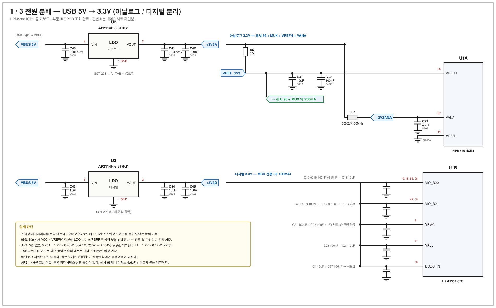
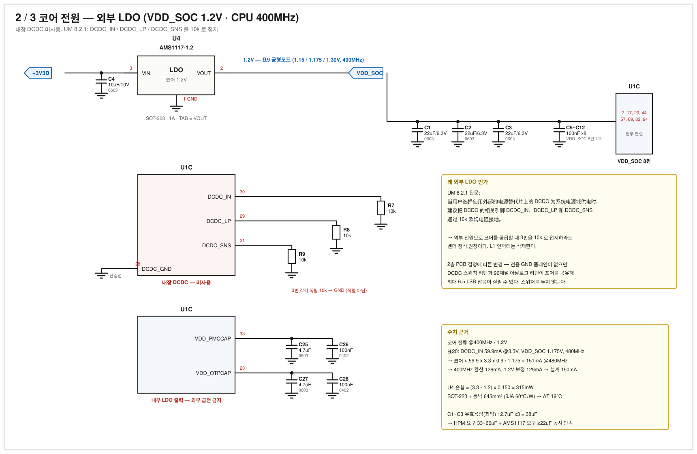
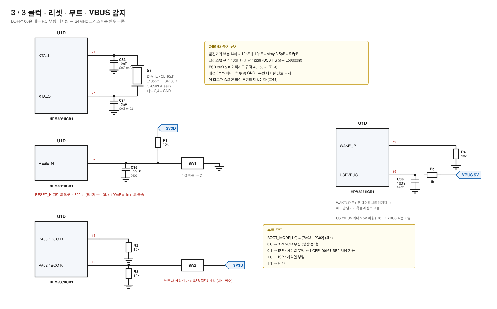

# HPM5361ICB1 전원 / 클럭 회로도

- 작성일: 2026-07-29
- 부품 선정 근거: [hpm5361-power-clock-design.md](hpm5361-power-clock-design.md)
- 핀 번호: HPM5300 데이터시트 Rev0.11 표2 (LQFP100) — 전수 대조 완료
- 도면 원본: [sch/](sch/) 디렉터리의 SVG (VSCode에서 바로 열림)

---

## 1 / 3 — 전원 분배 (USB 5V → 3.3V, 아날로그/디지털 분리)

**요점**

- LDO 2개(U2 아날로그 / U3 디지털)로 나눈다. **스위칭 레귤레이터는 쓰지 않는다** — 12bit ADC 보드에
  1~2MHz 스위칭 노이즈를 들이지 않는 쪽이 이득이고, 총 손실 0.6W는 SOT-223 2개로 감당된다.
- **VREFH와 센서 96개는 R6 뒤의 같은 노드**(VREF_3V3)에서 딴다. 비율계측의 전제다.
- VANA만 페라이트 비드(FB1)로 분리한다. VREFH에는 절대 넣지 않는다.

---

## 2 / 3 — 코어 전원 (내장 DCDC)

**요점**

- 외부 부품은 **인덕터 1개 + 캡**뿐이다. L1 = 4.7uH (데이터시트 표7: 2.2~10uH, typ 4.7uH).
- **C1 = 33~66uF 규격.** 0603 22uF 6.3V 3개로 채운다 (최악 유효용량 38uF).
- **DCDC_SNS(21)는 켈빈 감지선**이다. 부하 배선으로 쓰지 않는다.
- VDD_PMCCAP(33) / VDD_OTPCAP(23)은 **내부 LDO 출력**이다. 3.3V를 물리면 안 된다.

---

## 3 / 3 — 클럭 · 리셋 · 부트 · VBUS 감지

**요점**

- **LQFP100은 내부 RC 부팅을 지원하지 않는다**(표44). 크리스털이 죽으면 칩이 뜨지 않는다.
- **BOOT0(PA02) 버튼 또는 패드는 필수.** LQFP100만 USB0 ISP가 되므로 디버거 없는 복구 경로다.
- RESET_N은 저레벨 300us 이상 필요(표12) → 10k x 100nF = 1ms.

---

## 4. 네트리스트

| 넷 | 연결 |
|---|---|
| **VBUS** | USB 커넥터 / U2.3 (VIN) / U3.3 (VIN) / C40, C43 / R5.1 |
| **+3V3A** | U2.2 (VOUT) / C41, C42 / R6.1 / FB1.1 |
| **VREF_3V3** | R6.2 / U1: 65 (VREFH) / C31, C32 / **TMAG5253 x96 VCC, TMUX1308A x12 VDD** |
| **+3V3ANA** | FB1.2 / U1: 67 (VANA) / C29 |
| **+3V3D** | U3.2 (VOUT) / C44, C45 / U1: 9, 15, 85, 96 (VIO_B00), 42, 55 (VIO_B01), 31 (VPMC), 71 (VPLL), 30 (DCDC_IN) / C4, C13~C24, C37 / R1.1 / SW2 |
| **VDD_SOC** | L1.2 / U1: 7, 17, 20, 44, 57, 69, 83, 94, **21 (DCDC_SNS)** / C1, C2, C3, C5~C12 |
| **DCDC_LP** | U1: 29 / L1.1 |
| **DCDC_GND** | U1: 28 / GND (단일점) |
| **VDD_PMCCAP** | U1: 33 / C25, C26 |
| **VDD_OTPCAP** | U1: 23 / C27, C28 |
| **XI / XO** | U1: 74 / X1.1 / C33  ·  U1: 75 / X1.3 / C34 |
| **RESET_N** | U1: 26 / R1.2 / C35 / SW1 |
| **BOOT0 / BOOT1** | U1: 19 / R3, SW2  ·  U1: 18 / R2 |
| **WAKEUP** | U1: 27 / R4 |
| **USBVBUS** | U1: 68 / R5.2 / C36 |
| **GND** | U1: 8,10,16,22,32,43,56,66,70,76,84,95 / U2.1, U3.1 / X1.2, X1.4 / 모든 캡 하단 / R2.2, R3.2, R4.2 |
| **GNDA** | U1: 64 (VREFL) / C29~C32 하단 → GND와 단일점 합류 |

---

## 5. 지정자 / BOM

| 지정자 | 값 | 패키지 | LCSC | 구분 |
|---|---|---|---|---|
| U1 | HPM5361ICB1 | LQFP100 14x14 P0.5 | (재고 확인 필요) | — |
| **U2, U3** | **AP2114H-3.3TRG1** 1A LDO | SOT-223-3 (**TAB = VOUT**) | **C150716** | Extended |
| L1 | 4.7uH Isat 2.2A DCR 124mΩ | 2520 | C6807738 | Extended |
| FB1 | 600Ω@100MHz 200mA | 0603 | C1002 | Extended |
| X1 | 24MHz CL10pF ±10ppm ESR50Ω | 3225-4P | C70583 | **Basic** |
| C1, C2, C3 | 22uF 6.3V X5R | 0603 | C59461 | Basic |
| C40, C41 | 22uF 25V X5R | 0805 | C45783 | Basic |
| C4, C19, C20, C22, C24, C31, C43, C44 | 10uF 10V X5R | 0603 | C19702 | Basic |
| C25, C27, C29 | 4.7uF 16V X5R | 0603 | C19666 | Basic |
| C5~C18, C21, C23, C26, C28, C30, C32, C35, C36, C37, C42, C45 | 100nF 16V X7R | 0402 | C1525 | Basic |
| C33, C34 | 12pF 50V C0G | 0402 | C1547 | Basic |
| R1, R2, R3, R4 | 10k 1% | 0402 | C25744 | Basic |
| R5 | 1k 1% | 0402 | C11702 | Basic |
| R6 | 0Ω (250mA 통과) | 0402 | C17168 | Basic |
| SW1 | 리셋 택트 (옵션) | — | — | 옵션 |
| SW2 | BOOT0 택트/점퍼 | — | — | **필수** |

### 수량 집계

| 부품 | 수량 |
|---|---|
| 100nF 0402 (C1525) | 25 |
| 10uF 0603 (C19702) | 8 |
| 22uF 0603 (C59461) | 3 |
| 22uF 0805 (C45783) | 2 |
| 4.7uF 0603 (C19666) | 3 |
| 12pF 0402 (C1547) | 2 |
| 10k / 1k / 0Ω 0402 | 4 / 1 / 1 |
| AP2114H-3.3 (C150716) | **2** |
| L1 / FB1 / X1 | 1 / 1 / 1 |

**Extended는 3종**(LDO, 인덕터, 비드) → 피더 수수료 약 $3 x 3.

---

## 6. 실장 확인 체크리스트

1. VDD_SOC 8핀 **전부** 연결 (7, 17, 20, 44, 57, 69, 83, 94)
2. VSS 12핀 **전부** 연결
3. DCDC_SNS(21)를 벌크캡 지점에서 **켈빈**으로 분기했는가
4. VDD_PMCCAP(33) / VDD_OTPCAP(23)에 **3.3V를 물리지 않았는가**
5. VPMC(31)가 +3V3D에서 직접 오는가 (별도 스위치/LDO 금지 — 상하전 순서)
6. VREFH(65)와 센서 VCC가 **같은 노드**인가
7. VREFL(64)이 GND인가
8. BOOT0 진입 수단(SW2)이 있는가
9. 크리스털 배선 5mm 이내, 하부 통 GND
10. LDO의 **TAB이 VOUT 네트**에 붙어 있고 방열 동박이 100mm² 이상인가
